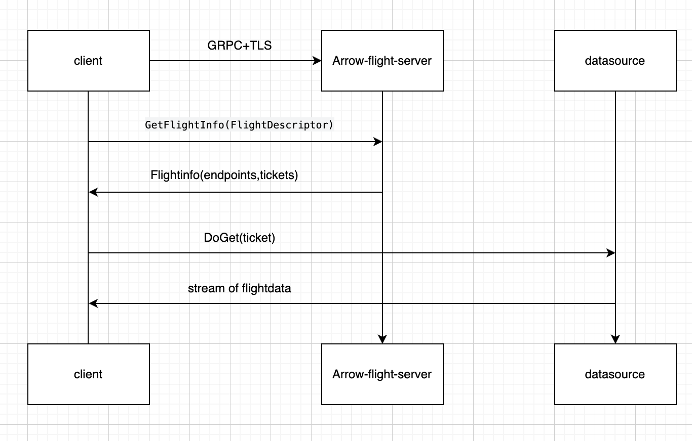

# **RFC0003 for Presto**

## Arrow Flight connector template in Presto

Proposers

* Elbin Pallimalil

## [Related Issues]

## Summary

Create a base Arrow Flight module in Presto which can be extended to create an Arrow Flight connector.

## Background

Apache Arrow Flight is a new general-purpose client-server framework that simplifies high performance transport of large datasets over network interfaces.

Presto currently supports different datasources through connectors for each type of datasource. The connectors could be using JDBC or some other protocol for datasource connection. If we use Flight client to connect to the different datasources we can improve the performance of the datasource connection. Also we would only need to develop one Flight client that can be used across different datasources instead of developing individual connectors for each type of datasource.

## Proposed Implementation

A template for Flight connector will be created as `presto-base-arrow-flight` module. Since each implementation of flight server will be different, this base module can be extended to create a flight connector that supports a particular implementation.

### High level design

#### Proposed design

The Arrow Flight libraries provide a development framework for implementing a service that can discover metadata and send and receive data streams. Flight APIs are used to retrieve the data from the corresponding table selected. The steps below need to be followed. 

1. Create a Flight Client using the host, port, ssl information of the Flight service where the route is opened. 
2. Use the Flight Client to authenticate to the Flight service. 
3. Create a FlightDescriptor using a JSON document containing the description of the connection to read or write. The description consists of: 
    1. Database name, host, port, username and password 
    2. Interaction properties including schema and table selected or the select statement 
4. Use the FlightDescriptor to obtain a FlightInfo object. 
5. Use the FlightInfo object to obtain the list of endpoints we will be retrieving data from. 
6. Use each endpoint to obtain a Ticket. 
7. Use the Ticket to obtain a Stream. 
8. Use the Stream to read data. 

#### Query execution using flight

### Low level design

#### Connector splits in Presto for FlightInfo tickets

Flight server can serve data using multiple tickets based on the connector type and query. Data can be fetched in parallel using the multiple flight tickets. Presto can create connector splits for each Flight Info ticket so that data can be fetched in parallel by different worker nodes.

#### Class diagram

## [Optional] Other Approaches Considered

Based on the discussion, this may need to be updated with feedback from reviewers.

## Adoption Plan

Whoever needs to implement a Flight connector for their particular implementation of Flight server will need to extend the `presto-base-arrow-flight` module and create a Flight connector module. Documentation will need to created on how the base module can be extended and what type of customizations are required in the child module.

## Test Plan

Unit tests can test the `presto-base-arrow-flight` module by mocking objects wherever necessary instead of using an actual implementation of Flight server. A POC has already been developed by creating `presto-base-arrow-flight` module and a child module that targets the IBM flavor of the Flight server.